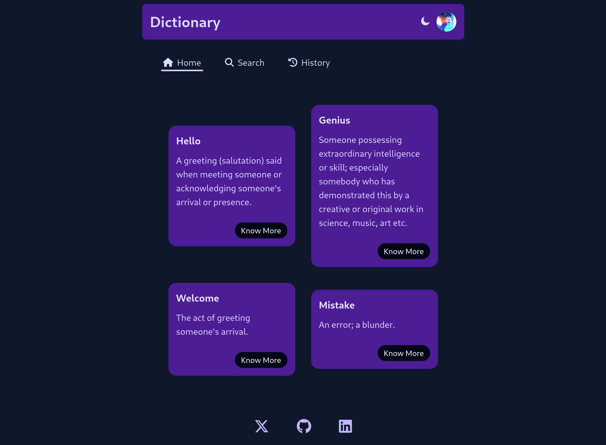
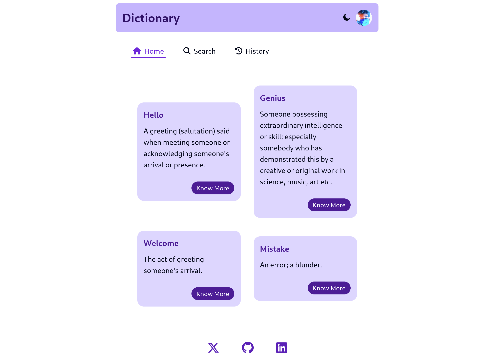
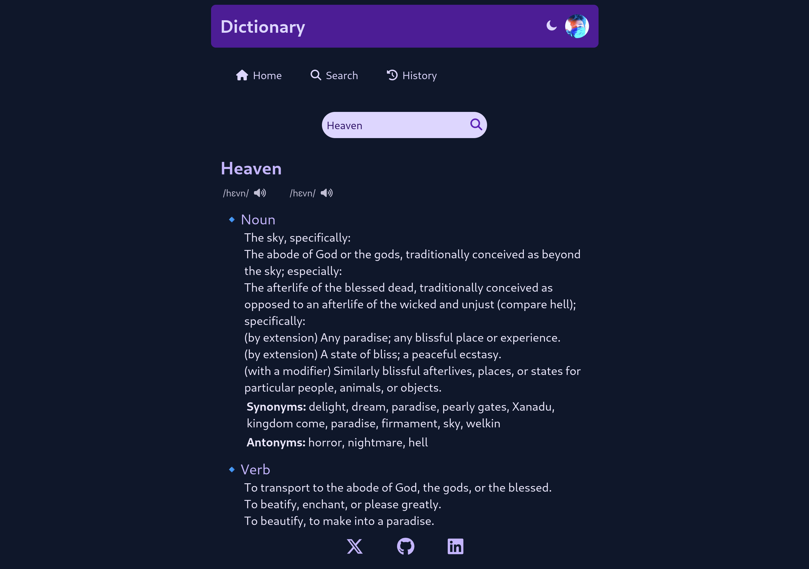

# Dictionary

## Overview

This Dictionary App is a React-based web application designed to help users look up words, view their definitions, phonetics, and example sentences. It features a simple user-friendly interface with dark and light themes and history tracking.

## Features

- **Search:** Users can search for words and view their definitions.
- **Phonetics:** Provides audio pronunciation for words.
- **History:** Keeps track of previously searched words.
- **Light/Dark Theme:** Supports both light and dark themes for better user experience.

## Usage

1. Type a word in the search bar and press Enter or click the search button.
2. View the word's definition, phonetics, synonyms, antonyms, and examples.
3. If word not found, then click on the *Google Link* to browse it on google.
4. Toggle between light and dark themes using the theme switcher in the header.
5. Click on previously searched words in the history section to view their details.
6. Click on cross icon to remove the word from history.
7. Click on Clear All button to clear complete history.

## Screenshots

<p align='center'>
  
  
</p>



## Components

### App.jsx

- **Purpose:** The main application that sets up the theme, handles user data, and renders the header and main section.
- **Key Features:**
  - Initializes user data from localStorage
  - Manages the theme state and provides a function to toggle themes.
  - Updates localStorage whenever user data changes.

### Header.jsx

- **Purpose:** The header component that contains the app's title and theme toggle button.
- **Props:**
  - *theme:* The current theme (light or dark).
  - *changeTheme:* Function to toggle the theme.

### MainSection.jsx

- **Purpose:** The main section that handles *routing* between different views: WelcomeScreen, Search, and History.
- **Props:**
  - *theme:* The current theme.
  - *userData:* User data including search history.
  - *setUserData:* Function to update user data.

### WelcomeScreen.jsx

- **Purpose:** The welcome screen displaying initial word cards with basic definitions and a link to view more details.
- **Key Features:**
  - Displays a list of word cards.
  - Links to search page with pre-filled words.
 
### Search.jsx

- **Purpose:** The search component that fetches and displays word data based on user input or URL parameters.
- **Key Features:**
  - Handles search input and updates the search word in the context.
  - Fetches word data from an API and displays it using *WordResult* component.
  - Manages loading and error states.
 
### WordResult.jsx

- **Purpose:** Displays detailed information about a searched word, including definitions, phonetics, synonyms, antonyms, and examples.
- **Props:**
  - *word:* The word being searched.
  - *phonetics:* Array of phonetic objects.
  - *meanings:* Array of meaning objects.

### History.jsx

- **Purpose:** Displays the search history and allows users to revisit previously searched words.
- **Key Features:**
  - Displays the date and the word user searched for previously.
  - Remove button to remove specific word from history.
  - Clear All button to clear history.

### Footer.jsx

- **Purpose:** The footer component that contains my three social links.
- **Props:**
  - *theme:* The current theme (light or dark).
 
### WordDataContext.jsx

- **Purpose:** Provides a context for managing the current search word across the application.
- **Key Features:**
  - Uses *React Context API* to manage global state.

## Technologies Used

- Vite + React
- React Router DOM
- Context API for state management
- Local Storage for user data persistence

## Installation
1. Clone the repository:
   ```bash
    https://github.com/Aayush259/Dictionary.git
    ```

2. Navigate to the project directory:
    ```bash
    cd Dictionary
    ```

3. Install dependencies:
    ```bash
    npm install
    ```

4. Start the development server:
    ```bash
    npm run dev
    ```

## Acknowledgements

- Font: [Google Fonts - Josefin Sans](https://fonts.google.com/specimen/Josefin+Sans)
- API: [Free Dictionary API](https://dictionaryapi.dev/)

## Contributing

Fuel our journey with your contributions and help our small project grow into something extraordinary! 🚀
